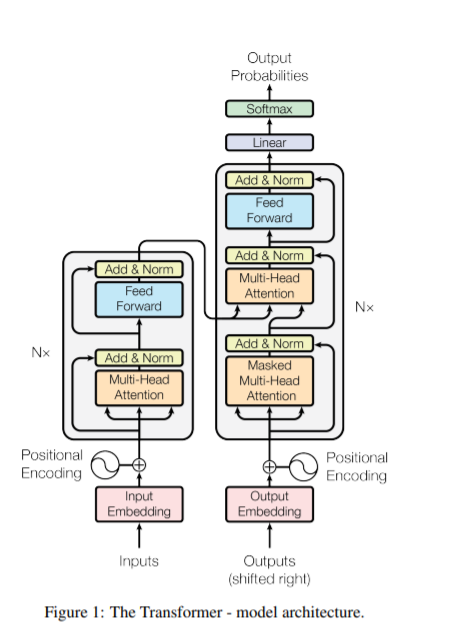

# Attention Implementation

I tried to implement the Transformer network architecture using pytorch, this architecture is based solely on attention mechanisms, dispensing with recurrence and convolutions entirely.

 

### Connect with me:

  <a href="https://www.linkedin.com/in/taha-tamir-351272145/" rel="nofollow noreferrer">
     LinkedIn
  </a> &nbsp;
 </p